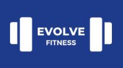
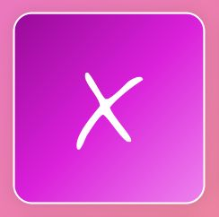

# Hiii! :wave: I'm Camilla! 

 
 
 

  
<b>About me</b> :sunflower:

  <table align="center">
    <tr>
      <td></td>
      <td>
        <strong>I'm an italian :pizza: web developer. I love music :notes:, cats :smiley_cat: and Sudoku :pencil2:. 
        I'm currently working on a complex puzzle :jigsaw: with each piece representing a new skill I acquire :hammer_and_wrench:. 
        If I'm not reachable, I'm problably cooking :fried_egg:, gardening :seedling: or crocheting :yarn:.</strong>
      </td>
    </tr>
  </table>

  
<b>Tech & tools</b> :coffee:

  
  &nbsp;
  
  &nbsp;
  
  &nbsp;
  
  &nbsp;
  
  &nbsp;
  
  &nbsp;
  
  &nbsp;
  
  &nbsp;
  
  &nbsp;
  
  &nbsp;
  
  &nbsp;
  
  &nbsp;
  
  &nbsp;
  
  &nbsp;
  
  &nbsp;
  
  &nbsp;
  
  &nbsp;
  
  &nbsp;
  

## Portfolio :arrow_right: <a href="https://camilla-scarton.github.io/portfolio/" target="_blank">Link</a>

## Best projects :arrow_heading_down:

<table>
<thead>
  <tr>
    <th>Detail</th>
    <th>Project name</th>
    <th>Tech</th>
    <th>Link</th>
  </tr>
</thead>
<tbody>
  
  <tr>
    <td align="center">
      
    </td>
    <td>
      

        
<strong>Portfolio</strong>

        My portfolio with 3 sections: About, Projects and Experiences.
      

    </td>
    <td align="center">
      
      
    </td>
    <td>:deciduous_tree: :arrow_right: <a href="https://camilla-scarton.github.io/portfolio/" target="_blank">Site link</a></td>
  </tr>
  
  <tr>
    <td align="center">
      
    </td>
    <td>
      

        
<strong>Todo list app</strong>

        Make your todos list, saved in the localStorage!
      

    </td>
    <td align="center">
      
      
    </td>
    <td>:deciduous_tree: :arrow_right: <a href="https://camilla-scarton.github.io/Todo-app-green/" target="_blank">Site link</a></td>
  </tr>
  
  <tr>
    <td align="center">
      
    </td>
    <td>
      

        
<strong>Mato photos project</strong>

        Move your mouse and see my beautiful cat!
      

    </td>
    <td align="center">
      
      
      
    </td>
    <td>:deciduous_tree: :arrow_right: <a href="https://camilla-scarton.github.io/mato/" target="_blank">Site link</a></td>
  </tr>

  <tr>
    <td align="center">
      
    </td>
    <td>
      

        
<strong>Evolve</strong>

        Web app for fitness enthusiasts!
      

    </td>
    <td align="center">
      
      
      
    </td>
    <td>:seedling: :arrow_right: <a href="https://github.com/Camilla-Scarton/Evolve-Project-Develhope" target="_blank">Repo link</a></td>
  </tr>
  
  <tr>
    <td align="center">
      
    </td>
    <td>
      

        
<strong>Tic, Tac, Toe</strong>

        First version with working Reset e New Game buttons!
      

    </td>
    <td align="center">
      
      
      
    </td>
    <td>:deciduous_tree: :arrow_right: <a href="https://camilla-scarton.github.io/tic-tac-toe/" target="_blank">Site link</a></td>
  </tr>
  
</tbody>
</table>
